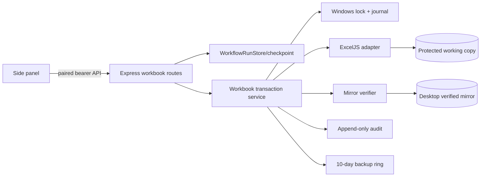
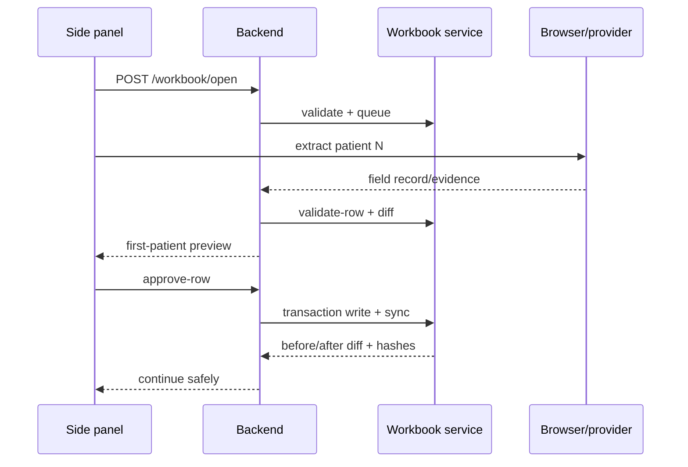
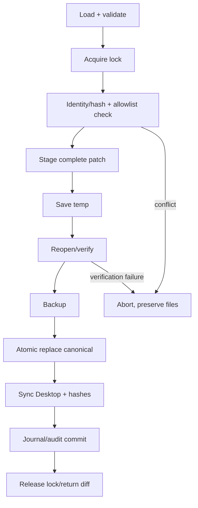
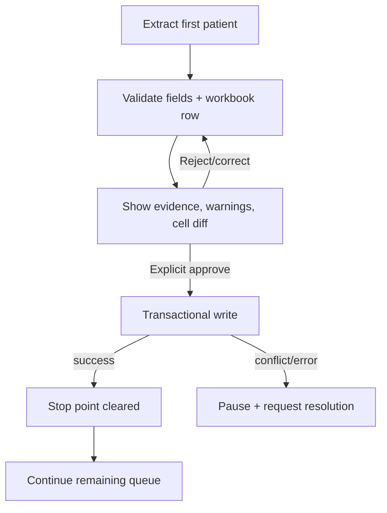

# Excel Support Implementation Plan

## 1. Executive Summary

Add an Excel adapter behind the existing paired loopback Node backend. The extension continues to own UI/extraction; the backend owns validated file I/O, transactions, locks, audit, and recovery. ExcelJS is primary; an isolated openpyxl worker is fallback only when fidelity fixtures fail. The protected working copy is canonical and a verified Desktop mirror is synchronized after each committed transaction. The first patient is previewed and explicitly approved before any write. Paths are configured/canonicalized/allowlisted once; nonblank differing targets conflict; completed rows require explicit correction; formulas are never overwritten automatically; backups are retained 10 days, capped at 100.

Current evidence: Express routes and pairing guard are in `chrome-ai-agent/server/index.js` (`localApiGuard`, lines 506-536); workflow creation/queue validation is `index.js` lines 1797-1820; first-record stop/continue is `index.js` lines 1856-1870 and `workflows/checkpoint.js` lines 1-14; durable revisioned run files are `workflows/run-store.js` lines 16-111; extension is Manifest V3 (`extension/manifest.json` lines 1-39).

## 2. Current Repository Architecture

The system is an MV3 side panel, service worker, and content script with a local Express server. `manifest.json` grants localhost permissions and loads `background.js`/`content.js` (lines 1-39). The server imports workflow, provider, diagnostics, and checkpoint modules (`server/index.js` lines 1-30), stores runs as JSON with per-run locks and atomic temp rename (`workflows/run-store.js` lines 16-111), parses strict MRN/date queues (`workflows/queue.js` lines 17-82), and exports CSV/Markdown (`workflows/exporters.js` lines 1-54). Extraction plans are submitted through `/workflow-runs/:runId/records/:recordId/plan` (route block in `server/index.js`, lines 1911-2045); field updates are persisted by `/workflow-runs/:runId/records/:recordId` (lines 1873-1908). The integration point is immediately after record validation/checkpoint and before `workflowStore.save`, with a new workbook transaction service called by explicit approval/continue.

## 3. Current Excel Gaps

No workbook dependency, adapter, route, path policy, file lock, cell allowlist, workbook hash, or cell-level audit exists. Existing queue input is text (`parsePatientQueue`), and exports are generated files rather than in-place workbook writes. Run persistence protects JSON revisions but not external files. These gaps require a server-side adapter and UI preview state; no production code is changed by this plan.

## 4. Requirements and Workbook Contract

Identity: configured canonical path (absolute, normalized, approved root); configured/pinned basename (the repository and playbook do not verify a literal filename, so do not invent one); worksheet exactly `Data Collection`; header row 3; schema fingerprint = SHA-256 of normalized header labels plus workbook version; required identity columns include MRN and surgery date; writable columns are exactly the 36 columns in Section 12. Reject `.xlsm`/macros, hidden target sheet, duplicate/moved headers, protected target sheet, external links unless read-only inspection explicitly allows them.

Rows: patient N maps to row N+3 (patient 1→4, 21→24). Before every write, read row and verify MRN and surgery date against queue/checkpoint hashes. Missing/duplicate identity, blank row, drift, or external modification stops with conflict. A partial row is resumable only when target cells match the transaction checkpoint; nonblank differing targets are conflicts. Completed rows are read-only unless an explicit correction operation is approved.

Value policy: dates become JavaScript Date/Excel date serial with number format `d/m/yyyy`; ISO and serial dates are validated as calendar dates. `0` remains numeric zero; booleans map to 0/1; decimal measures remain numbers; `0-2` and other ranges remain text; `N/A` is literal text only where profile permits; unresolved is blank plus a flag in record/audit. Empty/null unresolved normalize to blank. Reject invalid dates, accidental formula strings beginning `=`, `+`, `-`, or `@` (escape as text only when the field definition explicitly permits). Preserve Unicode and long text within Excel limits.

## 5. Architecture Options

| Option | Fit and trade-offs | Decision |
|---|---|---|
| Existing Node backend + ExcelJS | Same Windows process/path, paired auth, low setup, transactional control; ExcelJS may lose unsupported extensions/styles. | Primary |
| Node + openpyxl worker | Strong date/style fidelity; Python deployment and IPC complexity. | Fallback only after fidelity failure |
| Dedicated companion service | Isolation, but second lifecycle/auth/installer and port. | Reject for MVP |
| Native Messaging host | Exact filesystem access, but registration/admin burden duplicates backend. | Reject while backend is local |
| File System Access API | User-granted handle, browser permission UX, cannot guarantee Desktop mirror/unattended path. | Optional future |
| Upload/edit/download | Portable, no local path access; breaks live queue, locks, and unattended workflow. | Reject |

Dimension assessment: the Node backend and a companion service can access an exact Windows path; Native Messaging and backend have strong unattended operation but Native Messaging adds registration; File System Access and upload flows require user permission and cannot guarantee a stable Desktop mirror. ExcelJS/openpyxl preserve dates/styles better than SheetJS, while upload/download has the weakest metadata preservation. Backend/companion/Native Messaging support lock detection and atomic saves; browser picker and upload require a new copy protocol. Existing pairing makes the backend lowest security exposure; a second service or native host expands attack surface and deployment/maintenance. Portability favors Python/upload, but this Windows-local workflow prioritizes reliability, recovery, and UX continuity.

Detailed decision matrix (all requested dimensions):

| Dimension | A Node backend (ExcelJS primary; openpyxl fallback; SheetJS alternative) | B Companion service | C Native Messaging | D File System Access API | E Upload/edit/download |
|---|---|---|---|---|---|
| Compatibility / exact path | Fits Express/run store; same-machine canonical path | New protocol; local path possible | Host bridge; exact path | User-selected handle only | No original path |
| Setup / deployment | Lowest; Python packaging only if fallback | Installer/service lifecycle | Host manifest/registration | No installer, browser constraints | No installer, manual workflow |
| Reliability / unattended | Journal, retries, one-time config; strong unattended | IPC and service failures | Registration/lifecycle failures | Foreground permission/handle limits | Manual only |
| Preservation | ExcelJS supported cells/styles; openpyxl often stronger styles/dates; SheetJS weakest metadata | Depends on library | Depends on library | No native XLSX writer | Download serialization risk |
| Locks / atomic save | Exclusive lock, temp, Windows rename, hash | Implementable cross-process | Native Win32 possible | Less controllable | Avoids source lock, loses sync |
| Permissions / security | Existing bearer/origin + ACL; smallest exposure | Extra token/endpoint | High-impact bridge | Capability-scoped handle | Extra copies/exfiltration |
| Maintainability / UX | Existing side panel diff/approval/errors | Two codebases/troubleshooting | Platform-specific prompts | Picker/conflicts | Wrong-copy/reconcile risk |
| Failure recovery / portability | Journal/backups/recovery; Windows target, portable Node adapter | Recovery spans processes; runtime varies | Crash diagnostics harder; OS-specific | Handle invalidation; Chromium-specific | Manual restore; highest portability |
| Decision | Primary ExcelJS; openpyxl only if fidelity tests fail; SheetJS not for writes | Reject MVP | Reject while backend local | Future optional | Reject |

## 6. Recommended Architecture

Add proposed `server/workbooks/` modules: `contract.js`, `exceljs-adapter.js`, `path-policy.js`, `lock.js`, `transaction.js`, `sync.js`, `backup.js`, `audit-store.js`, `recovery.js`. Routes stay in Express and use existing bearer pairing (`server/index.js`, `localApiGuard`, lines 506-536). The side panel invokes status/open/patients/validate/approve/write/recover/close; extraction remains provider-driven and receives no workbook contents beyond required row fields. ExcelJS is selected for Node-native deployment; worker fallback is feature-flagged and contract-compatible.

## 7. Component Diagram



## 8. End-to-End Data Flow

Create run from workbook queue (read-only), map N→N+3, extract browser evidence into structured record, validate profile, generate cell diff, set `awaiting_first_review`, and stop. Approval calls transactional write; commit updates run/audit, verifies mirror, then continuation processes subsequent patients. Existing provider redaction and diagnostics remain (`server/index.js` lines 1252-1301, 2403-2429).



## 9. Workbook Reader Design

Implement `WorkbookReader` methods `open`, `metadata`, `patients`, `patientRow`, `identity`, `completion`, `partial`, `externalChange`, `compareCheckpoint`, `resume`. `open` canonicalizes path and checks extension, size, zip-entry limits, sheet/header/schema fingerprint, and read permissions. Queue reads identity columns and completion markers without exposing full workbook to providers. Every response includes `workbookId`, `fileHash`, `schemaFingerprint`, `sheet`, `row`, masked MRN hash, surgery-date hash, and warnings.

## 10. Workbook Writer Design

`writeRow` accepts one patient and a complete field record, never individual cells. Under lock: reload canonical, verify identity/hash and approved columns, calculate patch, reject unexpected target/non-target changes and formulas, stage all values, validate cross-field rules, save temp beside canonical, reopen and verify values/formats, create pre-write backup, replace canonical, sync mirror, hash-verify both copies, append journal/audit, then release lock. Return exact per-cell `{column,row,before,after,formatChanged}`. No write occurs while extraction is in progress.



## 11. API and Message Schemas

All routes require paired bearer token and origin guard from `localApiGuard`; use `Idempotency-Key` for mutations. Errors are JSON `{error,code,retryable,correlationId,details?}` and never include raw MRN.

| Route | Request → response | Errors/auth/idempotency/logging |
|---|---|---|
| `GET /workbook/status` | none → `{state,pathAlias,hash,schema,lock,sync}` | 401; metadata only; log hash prefix |
| `POST /workbook/open` | `{pathAlias,desktopPath?}` → `{workbookId,metadata,queue}` | path/sheet/format errors; idempotent by canonical hash |
| `GET /workbook/patients` | query `workbookId` → masked queue rows | 409 stale hash; read audit |
| `GET /workbook/patients/:n` | `workbookId` → identity/row/completion/partial | 404/409; no raw MRN |
| `POST /workbook/validate-row` | `{workbookId,runId,patientNumber,record,expected}` → `{valid,diff,warnings}` | 422 field/formula; idempotent read |
| `POST /workbook/write-row` | `{workbookId,runId,transactionId,patientNumber,record,expected}` → `{status,diff,hashes,sync}` | 409 conflict/lock; same key returns prior result |
| `POST /workbook/approve-row` | `{runId,patientNumber,approvalToken}` → `{status,preview}` | explicit user approval; idempotent token |
| `POST /workbook/recover` | `{workbookId,transactionId,action}` → `{state,hashes}` | recovery-required/auth; journal audit |
| `POST /workbook/close` | `{workbookId}` → `{closed:true}` | lock release; idempotent |

Implementation detail for every route: request bodies use strict JSON schemas (`additionalProperties:false`); `workbookId` is an opaque server handle, `runId` matches `WorkflowRunStore`, patientNumber is integer ≥1, and `expected` contains `{row,mrnHash,surgeryDateHash,rowHash,fileHash,schemaFingerprint}`. Responses always include `correlationId`; mutation responses include `transactionId`, status, and hashes. Validation runs path/sheet/header/identity/phase/type/allowlist checks before touching disk. Errors include `WORKBOOK_NOT_FOUND`, `INVALID_WORKBOOK`, `SCHEMA_MISMATCH`, `ROW_IDENTITY_MISMATCH`, `ROW_CONFLICT`, `FORMULA_REJECTED`, `WORKBOOK_LOCKED`, `SAVE_FAILED`, `SYNC_PENDING`, `RECOVERY_REQUIRED`, and `STALE_WORKFLOW_RUN`, each with `retryable` and masked details. Authorization is the existing paired extension origin plus bearer token (`server/index.js`, `localApiGuard`, lines 506-536); `approve-row` additionally requires a server-issued one-time approval token bound to run/patient/diff hash. `Idempotency-Key` is mandatory for open/write/approve/recover/close; keys are stored with result hashes and replayed only when the request digest matches, otherwise 409. Logging records route, correlation ID, outcome, latency, retry count, workbook/schema hash prefixes, and error code; it excludes workbook values, names, and raw MRNs. `GET` routes are read-only and may be safely retried; `write-row` commits only after all validations and lock acquisition.

## 12. Row and Column Mapping

The adapter rejects any target outside this exact allowlist. These names, keys, types, rules, formats, and phases are taken from `server/workflows/urolithiasis.js` (`UROLITHIASIS_FIELD_SCHEMA`, lines 6-20), `server/workflows/profiles/urolithiasis-v3.json` (`phaseFields`, lines 15-22), and `Extraction_Steps_v3_FINAL(1)(1).md` (lines 51-109).

| Excel | Clinical field name | Internal key | Expected type | Allowed values | Date format | Text format | N/A policy | Unresolved policy | Source phase |
|---|---|---|---|---|---|---|---|---|---|
| K | DM | `K` | boolean | 0/1 | — | numeric | never (determined 0/1) | blank + flag | comorbidities |
| L | HgbA1c (%) | `L` | text | decimal text or N/A | — | `@` | N/A if no HbA1c | blank + flag | laboratory |
| M | HTN | `M` | boolean | 0/1 | — | numeric | never | blank + flag | comorbidities |
| N | CVD | `N` | boolean | 0/1 | — | numeric | never | blank + flag | comorbidities |
| P | Recurrent UTI ≥2/6mo | `P` | boolean | 0/1 | — | numeric | never | blank + flag | comorbidities |
| Q | Recent Abx <3mo | `Q` | boolean | same as P (0/1) | — | numeric | never | blank + flag | comorbidities |
| R | Indwelling Catheter | `R` | boolean | 0/1 | — | numeric | never | blank + flag | operations |
| S | Previous Stone Surg. | `S` | text | PCNL/URS type or N/A | — | `@` | N/A when none | blank + flag | operations |
| T | Date of Prev. Surgery | `T` | date | valid date or N/A | `d/m/yyyy` | `@` only for N/A | N/A when none | blank + flag | operations |
| V | BPH | `V` | boolean | 0/1 | — | numeric | never | blank + flag | comorbidities |
| W | Prostatic Medications | `W` | text | Tamsulosin or N/A | — | `@` | N/A when BPH=0 | blank + flag | comorbidities |
| X | Prostatic Surgery | `X` | boolean | 0/1 | — | numeric | never | blank + flag | operations |
| Y | ASA Score | `Y` | number | integer ASA score | — | numeric | never | blank + flag | operations |
| AA | Date of Creatinine Test | `AA` | date | valid date | `d/m/yyyy` | — | no N/A rule; fallback Renal Profile date | blank + flag | laboratory |
| AB | UA: Nitrite | `AB` | boolean | 0/1 | — | numeric | never | blank + flag | laboratory |
| AC | UA: Pyuria (WBC/HPF) | `AC` | text | ranges such as 0-2, 6-10 | — | `@` | never | blank + flag | laboratory |
| AD | Urine pH | `AD` | text | observed pH | — | `@` | never | blank + flag | laboratory |
| AE | Urine Sp. Gravity | `AE` | text | observed gravity | — | `@` | never | blank + flag | laboratory |
| AF | Preop Urine Culture | `AF` | enum | Positive/Negative | — | `@` | never (result required) | blank + flag | laboratory |
| AG | Treated with Antibiotic | `AG` | boolean | 0/1 or N/A | — | numeric or `@` N/A | N/A when culture Negative | blank + flag | laboratory |
| AH | Repeat Urine Culture | `AH` | boolean | 0/1 | — | numeric | never | blank + flag | laboratory |
| AI | Date of Urine Culture | `AI` | date | valid date | `d/m/yyyy` | — | never | blank + flag | laboratory |
| AL | Date of CT Pre-op | `AL` | date | valid date | `d/m/yyyy` | — | never | blank + flag | radiology |
| BF | Perinephric Stranding | `BF` | boolean | 0/1 | — | numeric | never | blank + flag | radiology |
| BG | Anatomical Anomaly | `BG` | boolean | 0/1 | — | numeric | never | blank + flag | radiology |
| BH | Specify Anomaly | `BH` | text | anomaly type or N/A | — | `@` | N/A when BG=0 | blank + flag | radiology |
| BO | Prophylactic Abx | `BO` | boolean | 0/1 | — | numeric | never | blank + flag | medications |
| BP | UAS Used | `BP` | boolean | 0/1 | — | numeric | never | blank + flag | operations |
| CE | Est. Blood Loss (mL) | `CE` | number | nonnegative decimal; 0 valid | — | numeric | never | blank + flag | operations |
| CN | Discharge on Abx | `CN` | boolean | 0/1 | — | numeric | never | blank + flag | medications |
| CO | Discharge Abx — Specify | `CO` | text | drug name or blank | — | `@` | no antibiotic = blank | blank + flag | medications |
| CS | Post-op 1st Image Type | `CS` | text | e.g. CT KUB or N/A | — | `@` | N/A if no post-op CT | blank + flag | radiology |
| CT | Date of 1st Post-op Image | `CT` | date | valid date or N/A | `d/m/yyyy` | `@` only for N/A | N/A if no post-op CT | blank + flag | radiology |
| CU | Residual Stone | `CU` | boolean | 0/1 or N/A | — | numeric or `@` N/A | N/A if no post-op CT | blank + flag | radiology |
| CV | Residual Stone Size (mm) | `CV` | text | size/range or N/A | — | `@` | N/A if no stone/no CT | blank + flag | radiology |
| CW | Post-op Hydronephrosis | `CW` | boolean | 0/1 or N/A | — | numeric or `@` N/A | N/A if no post-op CT | blank + flag | radiology |

Dates are real Excel dates with `d/m/yyyy`; ranges and N/A are literal text with `@`, per extraction steps lines 104-109. `UROLITHIASIS_FIELD_SCHEMA` is the authoritative internal key/type contract; profile phase lists are authoritative for workflow routing.

## 13. Value Normalization and Formatting

Normalize at adapter boundary: ISO `YYYY-MM-DD`, valid JS Date, and Excel serial → UTC calendar date with `d/m/yyyy`; reject timezone rollover/invalid date. Preserve numeric zero and decimals; booleans → 0/1; range regex `^\d+\s*-\s*\d+$` → text; trim only where field contract allows. Null/empty/unresolved → truly blank and unresolved status. `N/A` is text. Strings beginning with formula prefixes are rejected (or prefixed apostrophe only for explicitly text fields). Never evaluate formulas; formulas in non-target cells are copied unchanged.

## 14. Locking and Concurrency

Use exclusive lock file adjacent to canonical (`.xlsx.lock`) containing random owner, PID, run ID, transaction ID, host, created/heartbeat timestamps. Acquire with `open(...,'wx')`; retry 5 times at 250/500/1000/2000/4000 ms for sharing violations. Timeout 30 s then return `WORKBOOK_LOCKED` and pause workflow; never overwrite. Stale lock requires age >10 minutes plus dead PID/host check, then quarantine and reacquire with audit. In-process mutex covers multiple backend runs; antivirus/cloud transient locks use bounded retries. Excel-open failures are user-facing and preserve files.

## 15. Atomic Saving and Synchronization

Canonical is protected working copy; Desktop is compatibility mirror. Write temp in same directory, flush/close, reopen verify, then Windows `MoveFileEx`/Node rename replacement; retain original backup until post-replace verification. Sync canonical→Desktop via temp copy, flush, atomic replace, hash compare. If mirror fails, canonical remains committed and state is `sync_pending`; retry on next status/recover, never reverse direction automatically. If Desktop is newer/different before write, require conflict resolution (no split brain). OneDrive/network/UNC/symlink/junction paths are rejected or require explicit policy.

## 16. Backups and Rollback

Store backups under configured private `.workbook-backups`; name `Stone_Study_Data.backup.YYYYMMDDTHHmmss.xlsx` with no patient identifiers. Create pre-write backup, verify hash, retain 10 days and max 100 newest (prune only after successful commit). Journal records transaction intent, temp, backup, canonical/mirror hashes. Rollback selects last verified backup under lock, validates schema, atomically replaces canonical, marks mirror pending, and appends audit. Corrupt temp/backup is quarantined; manual recovery copies a verified backup after stopping runs.

## 17. Crash Recovery and Resume

Persist journal/state atomically alongside run store: run ID, patient N/row, MRN/date hashes, extraction/review/workbook transaction states, transaction ID, before/after hashes, sync state. States: `queued→extracting→extracted→pending_review→approved→write_staged→writing→written→sync_pending→synced`; failures become `failed` or `recovery_required`.

```mermaid
stateDiagram-v2
  [*] --> queued
  queued --> extracting --> extracted --> pending_review
  pending_review --> approved: explicit approval
  approved --> write_staged --> writing
  writing --> written: verified replace
  written --> sync_pending: mirror failed
  sync_pending --> synced: hash match
  writing --> recovery_required: crash/unknown
  recovery_required --> written: after-hash matches
  recovery_required --> rollback: temp/backup decision
  rollback --> pending_review
  synced --> [*]
```

Startup scans journals and compares hashes: if after-hash canonical matches, mark written; if temp verifies and canonical unchanged, resume replace; if neither, rollback/ask review; skip only when identity and target cells match recorded after-state. Never duplicate a committed transaction (idempotency key).

## 18. Checkpoint and Approval Integration

Reuse `applyFirstRecordCheckpoint` semantics (`workflows/checkpoint.js` lines 1-14) and `/workflow-runs/:runId/continue` approval (`server/index.js` lines 1856-1870). Extend validation response with workbook diff/warnings. First patient extraction reaches `pending_review`; side panel shows field-by-field values, unresolved flags, and proposed cell diff. `approve-row` writes once, then marks `synced` and allows automatic continuation. Rejection edits record and regenerates diff. Conflicts, identity mismatch, completed-row correction, formulas, or lock errors always pause and require user action; no repeated permission for safe subsequent rows.



## 19. Security and Privacy

Enforce existing pairing/origin/bearer middleware (`server/index.js` lines 506-536), configured path aliases only, `realpath` containment, reject traversal/symlink/junction/UNC/network paths by default, fixed sheet name and column allowlist, extension/size/zip-entry limits, reject macros and external links for writes, and read-only mode outside adapter routes. Do not send workbook contents to providers; only structured extraction fields leave the browser. Audit files are ACL-restricted, logs contain hashes/masks, and raw workbook values are excluded from generic diagnostics. Treat malformed ZIPs, hidden sheets, protection, formulas, and OneDrive placeholders as explicit validation errors.

## 20. Audit Trail

Append JSONL records in proposed `.workbook-audit/` with timestamp, run/patient/row, transaction ID, before/after workbook hashes, target column, masked old/new value (or value hash), formatting change, evidence reference, confidence/status, provider, approval, error/retry counts, and sync result. Rotate daily, retain per privacy policy (default 10 days aligned with backups), restrict ACL, and provide redacted CSV export. General logs use correlation IDs and hashes only; never names/raw MRNs.

## 21. Library Selection

ExcelJS is recommended: Node-native (no new runtime), integrates with Express, and exposes cell values/styles/number formats/worksheets. Licensing and maintenance status must be verified against the versions approved in `package-lock.json` before adoption; this plan makes no unverified license or activity claim. Known risks: unsupported Excel extensions, some conditional formatting, external-link fidelity, calculation-chain preservation, and macro-enabled files; fidelity fixtures gate release. openpyxl has useful date/style handling but requires Python packaging/IPC and can alter unsupported workbook features; verify its pinned license/version during implementation. SheetJS (`xlsx`) is broad for tabular data but must be fixture-tested for styles, comments, validations, and metadata before any write use. If ExcelJS fixtures fail, invoke a pinned Python openpyxl worker via `spawn` with JSON over stdio, same contract, timeout, sandboxed cwd, and hash verification.

## 22. Required Repository Changes

Proposed (not existing) tree:

```text
chrome-ai-agent/
  server/workbooks/                 # proposed adapter, contract, locks, tx, sync, backup, audit, recovery
  server/routes/workbook.js         # proposed Express route module
  server/schemas/workbook.js        # proposed request/response schemas
  server/migrations/workbook-v1.js  # proposed journal/schema migration
  server/workflows/checkpoint.js    # modify to carry workbook preview/approval state
  server/index.js                   # mount proposed routes
  extension/sidepanel.js            # proposed workbook picker/status/preview controls
  tests/fixtures/workbooks/         # proposed valid, corrupt, locked, formula, style fixtures
  server/workbooks/*.test.js        # proposed unit/integration tests
  docs/excel-support.md             # proposed operator/recovery guide
```

Existing paths are cited in Section 2; all paths above are explicitly proposed.

## 23. Test Strategy

Every requested case is a row below; fixtures are proposed under `tests/fixtures/workbooks/` and modules are proposed unless an existing path is cited.

| Test | Level | Fixture | Expected outcome | Files/modules under test |
|---|---|---|---|---|
| Correct workbook | integration | valid.xlsx | opens and validates | proposed reader/contract |
| Wrong filename | integration | wrong-name.xlsx | rejected by basename policy | path-policy |
| Missing workbook | integration | absent path | clear not-found error | reader/routes |
| Wrong worksheet | integration | wrong-sheet.xlsx | rejected | reader/contract |
| Missing header row | integration | no-row3.xlsx | rejected | reader |
| Moved columns | integration | moved-header.xlsx | schema mismatch | contract |
| Duplicate headers | integration | duplicate-header.xlsx | rejected | contract |
| Protected sheet | integration | protected.xlsx | write rejected, read status explicit | adapter/writer |
| Corrupted workbook | integration | corrupt.xlsx | safe validation error | reader |
| Unsupported .xlsm | integration | macro.xlsm | rejected | path-policy/reader |
| External links | integration | external-links.xlsx | write rejected or read-only warning | reader |
| Patient 1→row 4 | unit | queue fixture | maps exactly | row mapping |
| Patient 21→row 24 | unit | queue fixture | maps exactly | row mapping |
| Missing MRN | integration | missing-mrn.xlsx | rejected before write | reader |
| Duplicate MRN | integration | duplicate-mrn.xlsx | queue conflict | reader |
| Missing surgery date | integration | missing-date.xlsx | rejected | reader |
| Blank rows | integration | blank-row.xlsx | flagged, no drift | reader |
| Partially completed row | integration | partial.xlsx | resumable only if checkpoint matches | transaction |
| Resumed run | integration | journal fixture | resumes correct patient | recovery/run-store |
| Row changed externally | integration | mutated-row.xlsx | 409 conflict | transaction |
| Date real Excel value | integration | dates.xlsx | serial/date object written | adapter |
| Date displays d/m/yyyy | integration | dates.xlsx | number format exact | adapter |
| `0-2` remains text | unit | values fixture | `@`, string preserved | normalization |
| Zero blood loss numeric | unit | values fixture | numeric 0 retained | normalization |
| Decimal HbA1c numeric/text per schema | unit | values fixture | value/type preserved | normalization |
| `N/A` text | unit | values fixture | literal text | normalization |
| Unresolved blank + flag | unit | values fixture | blank cell and status | writer/audit |
| Invalid date rejected | unit | invalid-date fixture | validation error | normalization |
| Formula injection rejected | security | formula-values.xlsx | prefixes rejected | normalization |
| Unicode drug names | integration | unicode.xlsx | exact Unicode round-trip | adapter |
| Long text | integration | long-text.xlsx | bounded/truncated per contract, no corruption | adapter |
| Only approved columns change | integration | pristine.xlsx | diff is allowlist only | transaction |
| Researcher cells unchanged | integration | researcher-values.xlsx | byte/value equality outside targets | transaction |
| Outside formulas unchanged | integration | formulas.xlsx | formulas preserved | adapter |
| Outside styles unchanged | integration | styled.xlsx | styles preserved | adapter |
| Hidden sheets unchanged | integration | hidden-sheet.xlsx | no hidden-sheet diff | adapter |
| Workbook properties unchanged | integration | properties.xlsx | properties preserved where possible | adapter |
| Workbook open in Excel | E2E | locked fixture | retries then pauses, no overwrite | lock/routes |
| Second agent simultaneous write | integration | shared fixture | one transaction wins, other 409 | lock/transaction |
| Stale lock | unit | stale .lock | quarantine/reacquire with audit | lock |
| Backend crash holding lock | integration | crash injection | startup stale recovery | lock/recovery |
| Antivirus temporary lock | integration | delayed-open mock | bounded retries | lock |
| Delayed file release | integration | delayed-open mock | retry policy honored | lock |
| Failure before temp save | integration | fault hook | canonical unchanged | transaction |
| Failure during temp save | integration | fault hook | temp quarantined | transaction |
| Failure after save before replace | integration | fault hook | backup/canonical safe | transaction |
| Desktop sync failure | integration | mirror denied | canonical committed, sync_pending | sync |
| Scratch/Desktop mismatch | integration | divergent copies | conflict, no split brain | sync |
| Corrupted temporary file | integration | corrupt temp | replace aborted | transaction |
| Interrupted process | integration | kill injection | journal recovery | recovery |
| Disk full | integration | quota mock | actionable failure, no partial | transaction |
| Permission denied | integration | ACL fixture | actionable failure | path-policy/transaction |
| Path unavailable | integration | offline path | pause/retry state | routes/recovery |
| First-patient preview | E2E | valid workbook + run | diff/evidence shown, no write | sidepanel/checkpoint |
| Rejection and correction | E2E | preview fixture | edit regenerates diff | sidepanel/routes |
| Approval and write | E2E | preview fixture | one idempotent commit | routes/transaction |
| Automatic continuation | E2E | two-patient queue | second starts only after approval | checkpoint/workflow |
| Conflict after approval | E2E | mutated row | pauses for resolution | transaction/checkpoint |
| Crash after approval before write | integration | journal fixture | resumes pending write safely | recovery |
| Crash after write before state persistence | integration | journal fixture | after-hash marks written, no duplicate | recovery/run-store |
| Arbitrary path rejected | security | traversal/path fixture | 400/403 | path-policy/routes |
| Path traversal rejected | security | `..` path | rejected | path-policy |
| Unapproved worksheet rejected | security | wrong-sheet.xlsx | rejected | contract |
| Unapproved column rejected | security | patch with A1 | rejected | contract/writer |
| Formula payload rejected | security | formula-values.xlsx | rejected | normalization |
| Malicious workbook safe | security | zip-bomb/malformed | bounded parse, no crash | reader |
| Unauthenticated request rejected | security | no bearer | 401 | `server/index.js` `localApiGuard` lines 506-536 |
| Sensitive data absent from logs | security | MRN fixture | logs contain hashes/masks only | audit/observability |

## 24. Migration and Rollout Plan

Stage 0 read-only inspection: entry = valid paired backend and fixture; exit = queue/hash displayed, zero writes. Stage 1 synthetic writes: generated fixtures, fidelity/hash tests pass. Stage 2 disposable real copy: before/after diff reviewed, mirror and restore verified. Stage 3 one-patient supervised pilot: explicit preview/approval, manual Excel verification, audit and backup present. Stage 4 supervised multi-patient: first checkpoint, continuation, injected lock/crash/conflict tests pass and no duplicate rows. Stage 5 broader use: 30 successful disposable/approved runs, zero unreviewed writes, recovery drill and operator sign-off. Roll back by disabling write routes/feature flag and restoring last verified backup.

## 25. Risks and Open Decisions

| Decision | Recommended default (chosen) | Alternatives/consequences |
|---|---|---|
| Canonical versus two copies | Protected working copy canonical; verified Desktop mirror | Single Desktop canonical is simpler but less safe for scratch workflows |
| Node versus Python | Existing Node + ExcelJS; openpyxl worker only if fidelity fails | Python adds deployment/IPC |
| First-row timing | After explicit review and diff | Before review risks unapproved writes |
| File selection | Configure/canonicalize/allowlist once | Per-run picker improves flexibility but weakens unattended operation |
| Backup retention | 10 days, max 100 | Longer retention increases privacy/storage |
| Formulas in targets | Never overwrite automatically | Explicit formula mode requires calculation/security design |
| Existing target values | Nonblank differing values conflict | Blind overwrite risks researcher data |
| Completed reruns | Require explicit correction approval | Automatic update can silently alter finalized data |

Largest risks: ExcelJS fidelity loss; Windows/OneDrive locks; split-brain mirror; malformed/malicious workbooks; identity/row drift. Mitigate with fixtures, hashes, locks, allowlists, backups, and staged gates.

## 26. Prioritized Implementation Tasks

| Task ID | Priority | Component | Files affected | Description | Dependencies | Complexity | Test requirement | Acceptance criteria |
|---|---|---|---|---|---|---|---|---|
| P0-1 | P0 | Contract | proposed `server/workbooks/contract.js` | Define schema, 36-column allowlist, normalization | none | M | contract unit tests | rejects unknown columns; all columns typed |
| P0-2 | P0 | Reader | proposed `reader.js` | Validate/open/read queue and identity | P0-1 | M | fixture integration | N→N+3 and hashes verified |
| P0-3 | P0 | Writer | proposed `exceljs-adapter.js` | Approved-cell patch and formatting | P0-1 | L | value/style tests | only targets change |
| P0-4 | P0 | Transaction | proposed `transaction.js` | Temp save, reopen verify, atomic replace | P0-3 | L | failure injection | no partial writes |
| P0-5 | P0 | Lock/security | proposed `lock.js`,`path-policy.js` | Windows lock, path allowlist, auth hooks | none | M | concurrency/security | locked files never overwritten |
| P0-6 | P0 | Routes | proposed `routes/workbook.js`, `server/index.js` | Implement status/open/read/validate/write/close | P0-2..5 | L | API integration | paired bearer + idempotency |
| P0-7 | P0 | Audit/backups | proposed `audit-store.js`,`backup.js` | Journal, hashes, retention | P0-4 | M | audit/rollback tests | exact cell diff and 10-day ring |
| P0-8 | P0 | Checkpoint | existing `checkpoint.js`, side panel | Preview/approval gate | P0-6 | M | E2E first patient | no write before approval |
| P1-1 | P1 | Sync | proposed `sync.js` | Canonical→Desktop hash-verified mirror | P0-4 | M | mirror failure tests | sync_pending recovery |
| P1-2 | P1 | Recovery | proposed `recovery.js` | Startup state machine and resume | P0-7 | L | crash matrix | no duplicate/skip |
| P1-3 | P1 | UI | `extension/sidepanel.js/.html/.css` | Picker/status/diff/conflict UX | P0-8 | M | Playwright | accessible approval flow |
| P1-4 | P1 | Fixtures | proposed `tests/fixtures/workbooks` | Realistic fidelity corpus | P0-3 | M | fixture suite | styles/formulas preserved |
| P1-5 | P1 | Pilot tooling | proposed migration scripts/docs | Disposable copy and rollback commands | P1-1/2 | S | script tests | operator runbook works |
| P1-6 | P1 | Security review | proposed security tests | Threat cases and log redaction | P0-5/7 | M | security integration | no arbitrary path/data leakage |
| P2-1 | P2 | Concurrency | lock/transaction modules | Multi-instance and antivirus retries | P0-5 | M | stress tests | bounded retries/pause |
| P2-2 | P2 | Fidelity fallback | proposed `openpyxl-worker.js` | Fallback only on failed fixtures | P1-4 | L | parity tests | same contract/results |
| P2-3 | P2 | Completed rows | writer/checkpoint | Explicit correction workflow | P0-8 | M | rerun tests | completed rows protected |
| P2-4 | P2 | External changes | reader/transaction | Non-target and target conflict detection | P0-2/4 | M | mutation tests | conflict with diff |
| P2-5 | P2 | Audit export | audit route/docs | Redacted CSV and rotation | P0-7 | S | export tests | no raw MRNs |
| P2-6 | P2 | Recovery drills | tests/docs | Disk/permission/corruption drills | P1-2 | M | fault injection | documented restore |
| P2-7 | P2 | Performance | adapter | Benchmark large workbook and limits | P0-3 | M | perf suite | bounded latency/memory |
| P3-1 | P3 | Documentation | `docs/excel-support.md` | Operator/security/recovery guide | P1-5 | S | doc review | complete runbook |
| P3-2 | P3 | Observability | diagnostics integration | Metrics/correlation without PHI | P0-6 | S | log assertions | masked telemetry |
| P3-3 | P3 | Maintenance | CI config/tests | Fixture regression and dependency pinning | P1-4 | S | CI job | repeatable fidelity gate |
| P3-4 | P3 | Future API | schemas/docs | Versioned contract and migration notes | P2 | S | schema compatibility | v1 backward-compatible |

## 27. Definition of Done

Workbook validates before use; queue is read directly; N maps correctly; MRN/date verified every write; only 36 approved columns change; dates/ranges/zero/N/A/blank retain required types; first-patient preview includes diff and explicit approval; writes are transactional, locked, backed up, audited, and recoverable; canonical/mirror hashes agree or are visibly pending; crash recovery avoids duplicate/skip/corruption; unsupported filesystem access is impossible; all unit/integration/E2E/security/fidelity tests pass; disposable supervised pilot meets Stage 4/5 gates. Validate with `node --check server/index.js`, `npm --prefix server test`, and Playwright suite after implementation (not run because this deliverable changes no production code).
